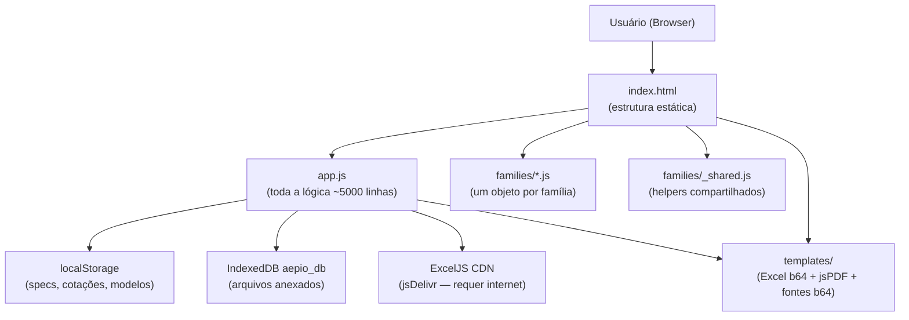

# Aépio — Gerador de Código de Medidores

> **Versão:** 1.2
> **Status:** em desenvolvimento / beta
> **Última atualização:** 2026-06-11
> **URL de produção:** não hospedado — aplicação local (abrir `index.html` no navegador)
> **Repositório:** não versionado em GitHub ainda

---

## 1. Resumo Executivo

Ferramenta interna da Aépio para configurar medidores de vazão do fabricante **Tancy** passo a passo, gerar **order codes** padronizados, **Folhas de Dados em Excel** (preenchidas automaticamente no template oficial Tancy) e **resumos em PDF**. Atende a área comercial/técnica que especifica instrumentação. Owner de negócio: [PENDENTE — verificar com o owner]. Owner técnico: Matheus Gonçalves. Tier: 3 (aplicação de suporte interno, zero dependência de infraestrutura cloud).

---

## 2. Contexto de Negócio

### Problema resolvido
O processo de especificação de medidores Tancy envolvia montar o order code manualmente consultando tabelas de codificação por família, depois preencher a folha de dados Excel à mão — processo sujeito a erro e lento. O app elimina ambas as etapas.

### Usuários típicos
Engenheiros de aplicação e vendedores técnicos da Aépio. Volume: equipe pequena (< 10 pessoas), uso diário em propostas e cotações.

### Fabricante único
A aplicação é específica para produtos **Tancy** (TEF, TCF, TYL, TBQM, TUS, TEC III). Não existe conceito de "trocar de fornecedor" — o código e os templates são vinculados ao catálogo Tancy. Adicionar linha de outro fabricante equivale a criar uma nova família do zero (ver seção 12).

### Fluxo de negócio suportado
1. Engenheiro recebe requisição do cliente com dados de processo.
2. Abre o app, seleciona a família de medidor.
3. Percorre o wizard passo a passo, selecionando opções de cada parâmetro.
4. O order code é gerado em tempo real.
5. Preenche condições de processo (fluido, temperatura, vazão, pressão).
6. Exporta Folha de Dados em Excel e/ou PDF resumo para entrega ao cliente.
7. Opcionalmente adiciona o item à cotação ativa e gera PDF consolidado.

### Termos de domínio

| Termo | Significado |
|-------|-------------|
| **Order code** | Código alfanumérico que descreve integralmente a configuração de um medidor para compra/fabricação |
| **DN** | Diâmetro nominal da tubulação (ex: DN50 = 2 polegadas) |
| **Folha de Dados** | Documento técnico padronizado entregue ao cliente e ao fabricante |
| **Designação G** | Nomenclatura de medidores de gás (G6, G10, G650 etc.) — codifica a faixa de vazão máxima |
| **Prefixo** | Primeiros 2–4 caracteres do order code que identificam família e submodelo |
| **Schedule** | Espessura de parede de tubulação (SC40, SC60, SC80) |
| **ATEX / Área Classificada** | Certificação para ambientes com risco de explosão (gás, poeiras) |
| **TW (Termopoço)** | Alojamento para sensor de temperatura integrado ao medidor |
| **EVC** | Eliminador de volumes cativos — acessório opcional em medidores rotativos |
| **YYY** | Código especial para conexão de processo fora do catálogo padrão — exige descrição livre |
| **Range** | Relação Qmín/Qmáx (ex: 1:10, 1:20) — amplitude de medição |
| **Cotação** | Lista de instrumentos configurados para envio ao cliente |

### Como era feito antes
Consulta manual às tabelas de codificação em Excel (arquivo legado em `docs/GeradorCodigos_legacy/`), preenchimento manual da folha de dados e concatenação do order code à mão.

---

## 3. Stack Técnica

- **Frontend:** HTML5 / CSS3 / JavaScript puro (vanilla JS, sem framework, sem bundler). Carregado via `file://` ou qualquer servidor estático.
- **Biblioteca de PDF:** jsPDF (UMD, bundled localmente em `templates/jspdf.umd.min.js`)
- **Biblioteca de Excel:** ExcelJS 4.4.0 — carregado via CDN `https://cdn.jsdelivr.net/npm/exceljs@4.4.0/dist/exceljs.min.js` — **requer internet**
- **Fontes:** IBM Plex Mono via Google Fonts (**requer internet**) + Trevia Groteska bundled em base64 (`templates/font_trevia_b64.js`)
- **Autenticação:** nenhuma — app local sem autenticação
- **Camada de dados:** `localStorage` (specs, cotações, modelos) + `IndexedDB` (arquivos binários anexados)
- **Automação:** não aplicável (sem Power Automate, Azure Functions ou qualquer backend)
- **Hospedagem:** local. Pode ser servido por qualquer servidor estático sem configuração especial.
- **APIs externas:** nenhuma em runtime
- **CI/CD:** não configurado
- **Observabilidade:** nenhuma

---

## 4. Arquitetura



### State machine de fases

A variável global `phase` controla o que é renderizado. Transições feitas por `navigate(phase)`, que atualiza `phase` + History API + chama `render()`.

| Fase | O que é renderizado |
|------|---------------------|
| `'family'` | Grade de cards de famílias disponíveis |
| `'configure'` | Wizard passo a passo de parâmetros |
| `'conditions'` | Formulário de condições de processo + code display |
| `'order-list'` | Lista de cotações (previsto v2, ainda oculto) |
| `'order'` | Detalhe de uma cotação |

### Módulos principais em `app.js`

| Bloco | Linhas aprox. | Responsabilidade |
|-------|--------------|-----------------|
| Constantes e state | 1–260 | `FAMILIES`, `FAMILY_META`, `PARAM_DETAILS`, `STEP_HELP`, estado global (`phase`, `paramValues`, `optionalValues`, etc.) |
| Multi-cotação | 260–415 | `getOrdersList`, `createNewOrder`, `switchToOrder`, `deleteOrder`, `addToOrder` — operações de cotação sobre localStorage |
| Navegação | 415–500 | `navigate()`, History API, mobile nav |
| Render principal | 500–700 | `render()` — dispatcher de fases; `renderFamilyPhase()`, `renderConfigurePhase()` |
| Wizard UI | 700–1100 | `makeStepPanel()`, `makeStepContent()`, `makeOptionsGrid()` — renderiza cada passo |
| `buildCode()` | 1100–1602 | Monta o order code e segmentos anotados; lógicas especiais para TYL e TBQM (lookup-table prefix) |
| Condições | 1602–1873 | `renderConditionsHeader()`, `setupConditionsListeners()`, `setupNumericValidation()` |
| `parseCode()` | 1894–2116 | Decodifica order code → `paramValues`; lógicas especiais para TYL e TBQM |
| `getExtras()` / `getProcessConditions()` | 2116–2800 | Coleta campos do formulário; `getProcessConditions()` (linha 2709) / `setProcessConditions()` (linha 2744) para salvar/restaurar |
| `buildExcelWorksheet()` + `generateExcel()` | 2173–2400 | Carrega template base64 via ExcelJS, delega preenchimento a `fam.populateExcel()`, dispara download |
| `generatePDF()` / `generateSummarySheet()` | 2400–2680 | jsPDF — monta folha de dados e resumo em PDF no browser |
| `restoreState()` | 2686 | Restaura família + paramValues + optionalValues e navega para uma fase |
| Specs / Templates / Order UI | 2800–5000 | Salvar/listar/restaurar especificações e modelos, UI de cotação |
| Sidebar / Toast / Helpers | 5000+ | `updateSidebarClients()`, `showToast()`, `el()` (helper de criação de DOM) |

### Interface de cada família (objeto JS em `families/*.js`)

```js
{
  id: 'TEF',
  name: 'TEF — Eletromagnético',
  prefix: 'TEFP',          // prefixo do order code
  skipConditions: false,   // true = pula formulário de condições (TEC III)

  defaults: {},            // valores padrão iniciais para paramValues
  parameters: [            // array de parâmetros do wizard (ver abaixo)
    { id, label, required, fixed, options | getDynamicOptions(pv) }
  ],
  optionals: [],           // parâmetros opcionais (append ao code)

  buildCode(pv) {},        // monta o order code
  getDescription(pv) {},   // descrição textual do instrumento
  getFlowRange(pv) {},     // → { qmin, qmax } — auto-fill para TYL, TBQM, TUS
  getDnDefaults(dn, state){}, // → { qmin, qmax, face } por DN — TEF, TCF

  populateExcel({ ws, set, setNum, getSheet, code, paramValues, optionalValues, ex, map }) {},
  pdfMappings: { ... },    // funções que retornam strings para o PDF
}
```

### Famílias, prefixos e templates

| Família | Arquivo | Prefixo code | Variável template | Template Excel |
|---------|---------|--------------|-------------------|----------------|
| TEF | `families/tef.js` | `TEFP` | `FD_TEMPLATE_B64` | `templates/template_fd.js` |
| TCF | `families/tcf.js` | `TCF` | `FD_CORIOLIS_B64` | `templates/template_coriolis.js` |
| TYL | `families/tyl.js` | `0R` | `FD_ROT_B64` | `templates/template_rot.js` |
| TBQM | `families/tbqm.js` | `0T` | `FD_TURB_B64` | `templates/template_turb.js` |
| TUS | `families/tus.js` | `TUS` | `FD_TUS_B64` | `templates/template_tus.js` |
| TEC III | `families/tec.js` | `0TEC` | `FD_TEC_B64` | `templates/template_tec.js` |
| DIAF | `families/diaf.js` | `0DM` | — | sem Excel/PDF |

As variáveis `FD_*_B64` são constantes globais declaradas em cada `templates/template_*.js`. A função `buildExcelWorksheet()` monta um mapa local `TEMPLATE_B64_MAP` (linha 2188) associando `fam.id` à variável correspondente.

### Fluxo de geração de Excel

1. `generateExcel()` chama `buildExcelWorksheet()`.
2. `buildExcelWorksheet()` resolve a variável `FD_*_B64` via `TEMPLATE_B64_MAP[fam.id]`.
3. Converte base64 → `ArrayBuffer` → carrega com `new ExcelJS.Workbook().xlsx.load(buffer)`.
4. Para famílias com `skipConditions: true` (TEC), o objeto `ex` passado é restrito a `{ cliente, num_doc, aplicacao, notas }` — evita contaminação com valores residuais de outra família no DOM.
5. Chama `fam.populateExcel({ ws, set, setNum, getSheet, code, paramValues, optionalValues, ex, map })`.
6. Cada `populateExcel` escreve nas células específicas da aba `Planilha1` do template.
7. `workbook.xlsx.writeBuffer()` → `Blob` → `<a download>` → download automático.

### Fluxo de geração de PDF

- **Folha de Dados** (`generatePDF`): jsPDF programático, fonte Trevia Groteska registrada a partir de `templates/font_trevia_b64.js`. Dados do instrumento obtidos de `fam.pdfMappings`.
- **Folha de Resumo** (`generateSummarySheet`): documento compacto com order code + tabela de especificações + condições de processo.
- **PDF Consolidado de Cotação** (`generateConsolidatedPDF`): itera sobre todos os itens da cotação e concatena a Folha de Resumo de cada um.

### Padrão de auto-fill com `dataset.auto`

Campos preenchidos automaticamente (qmin, qmax, face, range) recebem `dataset.auto = '1'`. O listener de `input` manual deleta esse atributo — a partir daí o campo não é mais sobrescrito ao re-entrar na tela. **Atenção:** `dispatchEvent(new Event('input'))` no qmax (para acionar o cálculo do range) também aciona o listener. Por isso, `renderConditionsHeader()` re-seta `dataset.auto = '1'` nos dois campos imediatamente após o dispatch.

---

## 5. Modelo de Dados

Não há banco de dados. O estado persistido usa **localStorage** e **IndexedDB** no browser do usuário.

### Chaves localStorage

| Chave (`localStorage`) | Conteúdo |
|------------------------|----------|
| `aepio_orders_list` | `Array<{ id, name, createdAt }>` — lista de cotações |
| `aepio_active_order_id` | ID string da cotação ativa |
| `aepio_order_items_{id}` | Array de itens da cotação `id` |
| `aepio_order_header_{id}` | Objeto de cabeçalho da cotação |
| `aepio_order_atts_{id}` | Array de metadados de arquivos anexados |
| `aepio_gerador_specs` | Array de especificações salvas (`STORAGE_KEY`) |
| `aepio_gerador_templates` | Array de modelos salvos (`TEMPLATES_KEY`) |

### Estrutura de um item de cotação

```js
{
  id: 'abc123',          // gerado por generateId()
  qty: 1,
  tag: 'FT-101',
  status: 'pendente',    // pendente | em_revisao | aprovado | enviado
  familyKey: 'TEF',
  paramValues: { dn: '050', lining: 'A', ... },
  optionalValues: { grounding_rings: 'R1' },
  processConditions: { fluido: 'ÁGUA', qmin: '10', qmax: '450', ... },
  code: 'TEFP025EC1...',
}
```

### Campos de `getProcessConditions()` — 29 campos

Salvos/restaurados via `getProcessConditions()` (linha 2709) e `setProcessConditions()` (linha 2744):

`fluido`, `estado`, `temp`, `face`, `sentido`, `qop`, `qmin`, `qnorm`, `qmax`, `qunit`, `pmin`, `pnorm`, `pmax`, `p_unit`, `pressao`, `pressao_unit`, `viscosidade`, `viscosidade_unit`, `densidade`, `densidade_unit`, `dens_relativa`, `compress`, `peso_mol`, `temp_proj`, `pressao_proj`, `cliente`, `num_doc`, `aplicacao`, `notas`.

> `getExtras()` (linha 2121) retorna um conjunto maior com campos derivados (ex: `pmin_raw`, `pmax_raw` — valor sem unidade para templates TEF) que **não** são salvos em `processConditions` — são recalculados na hora da exportação.

### IndexedDB

- **Database:** `aepio_db` (versão 1, constante `IDB_NAME`)
- **Object store:** `order_files` (keyPath: `id`, constante `IDB_STORE`)
- **Uso:** binários de arquivos PDF/imagens anexados às cotações

---

## 6. Autenticação e Segurança

Não há autenticação. A aplicação roda inteiramente no browser local sem servidor de backend, sem segredos e sem chaves de API.

**Risco:** qualquer pessoa com acesso à pasta do projeto pode usar a aplicação. Aceitável para uso interno em máquina local. Se houver necessidade de controle de acesso no futuro, a hospedagem em servidor com autenticação HTTP básica (Nginx + htpasswd) é o caminho mais simples.

---

## 7. Integrações e Fluxos Power Automate

**Não aplicável.** Esta aplicação não possui integrações com Power Automate, Azure Functions, SharePoint, APIs externas ou qualquer serviço de backend. Toda a lógica roda no browser do usuário.

As únicas dependências de rede são:
- **ExcelJS 4.4.0** via CDN jsDelivr (`https://cdn.jsdelivr.net/npm/exceljs@4.4.0/dist/exceljs.min.js`) — necessário apenas para exportar Excel.
- **IBM Plex Mono** via Google Fonts — necessário apenas para a tipografia do app.

Se for necessário adicionar uma integração futura (ex: salvar specs em SharePoint, enviar cotação por e-mail), a abordagem recomendada é um Power Automate com trigger HTTP + conector SharePoint.

---

## 8. Deploy e CI/CD

### Deploy atual — distribuição manual via ZIP

Não há CI/CD configurado. O processo atual de distribuição é:

1. Verificar que todos os templates estão atualizados (`node scripts/sync_templates.js` se algum `.xlsx` foi alterado).
2. Zipar os arquivos de runtime para `C:\Users\mathe\Documents\Aepio-Gerador.zip`:
   ```
   index.html, app.js, style.css, logo-aepio.png, LEIA-ME.md,
   families/ (todos os .js), templates/ (todos os .js), images/
   ```
   Excluir: `docs/`, `scripts/`, `font/`, `server.js`, `.claude/`, `archive/`.
3. Compartilhar o ZIP. O destinatário extrai em qualquer pasta e abre `index.html`.

> Script de referência (PowerShell, executado na pasta do projeto):
> ```powershell
> Compress-Archive -Path 'index.html','app.js','style.css','logo-aepio.png','LEIA-ME.md','families','templates','images' -DestinationPath 'C:\Users\mathe\Documents\Aepio-Gerador.zip' -Force
> ```

### Requisitos do destinatário

- Navegador moderno (Chrome, Edge ou Firefox atualizado).
- Internet para exportação Excel (ExcelJS CDN) e fonte IBM Plex Mono. Demais funções (PDF, decode, specs) funcionam offline.

### Hospedagem futura (opcional)

Qualquer servidor estático funciona sem configuração especial (sem SSR, sem variáveis de ambiente, sem banco). Exemplos: Nginx, Apache, Azure Static Web Apps, GitHub Pages.

### Rollback

Guardar a versão anterior do ZIP. Para reverter, basta redistribuir o ZIP anterior — não há estado compartilhado em servidor.

### Variáveis de ambiente

Nenhuma. Todas as configurações são constantes em `app.js` (cores, labels) ou em `families/*.js` (tabelas de parâmetros).

---

## 9. Configurações e Variáveis

| Configuração | Onde está | Como atualizar | Valor atual |
|---|---|---|---|
| Versão exibida | `index.html` linha 59 | Editar string diretamente | `v1.2` |
| Templates Excel (base64) | `templates/template_*.js` | Editar `.xlsx` em `docs/` + `node scripts/sync_templates.js` | — |
| CDN ExcelJS | `index.html` linha 10 | Mudar URL ou baixar localmente | `exceljs@4.4.0` |
| Tabela de vazão TUS | `families/tus.js` `TUS_FLOW_RANGE` | Editar constante | ver arquivo |
| Face-to-face TUS | `families/tus.js` `TUS_FACE_DIST` | Editar constante | ver arquivo |
| Cores da UI (JS dinâmico) | `app.js` constante `B` linhas 8–13 | Editar valores hex | `--blue: #1A6DCB` |
| Variáveis CSS (HTML estático) | `style.css` variáveis `--blue`, `--bg`, `--border` | Editar CSS | ver arquivo |
| Fonte principal | `index.html` `<head>` Google Fonts link | Alterar URL | IBM Plex Mono |
| localStorage key (specs) | `app.js` linha 2698 `STORAGE_KEY` | Alterar constante (migração manual) | `aepio_gerador_specs` |
| localStorage key (modelos) | `app.js` linha 2836 `TEMPLATES_KEY` | Alterar constante (migração manual) | `aepio_gerador_templates` |

---

## 10. Regras de Negócio Críticas

### TYL e TBQM — código lookup-table (prefixo de 2 chars)

Em vez de concatenar cada parâmetro individualmente, `designacao + conexao` (TYL) ou `designacao + conexao + material + classe` (TBQM) são comprimidos em **2 caracteres** usando lookup-tables `TYL_PREFIXO` e `TBQM_PREFIXO` em seus respectivos arquivos. Motivo: o order code herdado do fabricante usa esse formato comprimido. O wizard usa os parâmetros separados; `buildCode()` os traduz via lookup.

### TUS — `model_type` ≠ `caliber`

`model_type` = número de vias acústicas (opções: 4, 6, 8). `caliber` = diâmetro do tubo em polegadas (opções: 3, 4, 6, 8, 10, 12). São parâmetros independentes no wizard. A designação gravada no Excel (célula `E8`) é `TUS-{model_type}` (ex: `TUS-6`), **não** o calibre.

### TUS — restrição TUS-8 vias mínimo 6"

TUS com 8 vias só disponível a partir de calibre 6" (DN150). Implementado em `getDynamicOptions` do parâmetro `caliber` em `tus.js`:
```js
if (pv.model_type === '8') return all.filter(o => parseInt(o.code) >= 6);
```

### TUS — CL900 + 3" tem face-to-face diferente

Para `CL900 + 3"`, distância face-a-face = 320 mm. Para todas as outras combinações, usa a tabela padrão `TUS_FACE_DIST`. Implementado com chave composta:
```js
const TUS_FACE_DIST = { '3':240, '4':300, ..., 'CL900|3': 320 };
// Resolução em renderConditionsHeader():
faceEl.value = TUS_FACE[pc + '|' + cal] || TUS_FACE[cal] || '';
```

### Range de medição — arredondamento para dezena

Range calculado como `Math.round((qmax / qmin) / 10) * 10`. Ex: ratio 67 → `1:70`, ratio 62 → `1:60`.

### Conexão especial YYY

Quando `process_conn === 'YYY'`, um campo de texto livre (`process_conn_custom`) guarda a descrição. Todo `getConexaoProcesso` deve ter o guard:
```js
if (params.process_conn === 'YYY') return params.process_conn_custom || 'Especial / Sob Consulta';
```
Se não tratado, retorna string vazia na folha de dados. TEF e TCF já têm o guard; outras famílias sem flanges DN não precisam.

### TEC III — sem condições de processo

`skipConditions: true`. A fase `conditions` é completamente pulada; a app vai direto de `configure` para `summary`. Ao gerar Excel, o objeto `ex` é restrito a `{ cliente, num_doc, aplicacao, notas }` para evitar contaminação com valores residuais de outra família no DOM.

### TUS — condições de processo parcialmente ocultas

`skipConditions: false`, mas as seções de processo (Fluido, Temperatura, Vazão, Pressão, Propriedades) ficam ocultas via `display: none` em `#conditions-process-sections`. Apenas Identificação e Dados do Instrumento são exibidos.

### Pressão — dois formatos em `getExtras()`

- `pmin_raw / pnorm_raw / pmax_raw`: valor numérico puro — para células separadas no template TEF (onde valor e unidade ficam em colunas distintas).
- `pmin / pnorm / pmax`: valor + unidade concatenados — para TCF e specs antigas.
Os campos `*_raw` **não** são salvos em `processConditions`; são recalculados na hora da exportação.

---

## 11. Pontos de Atenção e Lições Aprendidas

### 1. Layout do grid quebrado pelo wrapper de seções

- **Sintoma:** Seções Fluido/Vazão/Pressão apareciam em coluna estreita ao lado de Identificação.
- **Causa raiz:** `<div id="conditions-process-sections">` inserido dentro de um CSS grid tornou-se uma única célula do grid, comprimindo seus 24 filhos nela.
- **Solução:** `#conditions-process-sections { display: contents; }` em `style.css`.
- **Por quê:** `display: contents` torna o elemento transparente ao grid — filhos participam diretamente no grid pai. `display: none` (para TUS) ainda funciona porque sobrescreve `contents`.

### 2. `dataset.auto` deletado pelo próprio dispatch

- **Sintoma:** Qmin/Qmax paravam de ser atualizados automaticamente ao trocar o calibre do TUS.
- **Causa raiz:** `renderConditionsHeader()` preenchia os campos e depois chamava `dispatchEvent(new Event('input'))`. Esse evento acionava o listener que executa `delete this.dataset.auto`, interpretando o dispatch como edição manual.
- **Solução:** Re-setar `qminEl.dataset.auto = '1'` e `qmaxEl.dataset.auto = '1'` imediatamente após o dispatch.

### 3. TCF — conexão YYY retornava vazio no Excel

- **Sintoma:** Célula de conexão de processo ficava em branco ao usar YYY no TCF.
- **Causa raiz:** `TCF.pdfMappings.getConexaoProcesso` buscava em `TCF_FLANGES_BY_DN` — YYY não existe nessa tabela. TEF já tinha o guard.
- **Solução:** Adicionado `if (params.process_conn === 'YYY') return params.process_conn_custom` em `tcf.js`.

### 4. TUS — campo E8 vazio na Folha de Dados

- **Sintoma:** Campo "Designação" na folha de dados TUS aparecia vazio.
- **Causa raiz:** O código não alimentava a célula `E8`.
- **Solução:** `s('E8', pv.model_type ? 'TUS-' + pv.model_type : '')` em `tus.js`.

### 5. ExcelJS requer internet

- **Risco:** Exportação de Excel não funciona offline.
- **Mitigação:** Baixar `exceljs.min.js` localmente, colocar em `templates/`, atualizar a tag `<script>` no `index.html`.

### 6. `localStorage` é por origem — dados são perdidos ao trocar de pasta

- **Risco:** Se o usuário mover a pasta ou abrir de outro caminho (`file://`), as especificações salvas ficam acessíveis apenas da origem original.
- **Mitigação futura:** Implementar export/import de specs em JSON.

---

## 12. Como Estender/Modificar

### A. Adicionar uma nova família de medidor

**Arquivos a criar/alterar:** `families/novaFamilia.js` (criar), `app.js` (4 pontos), `index.html` (1 ponto se adicionar imagem).

**Passos:**
1. Criar `families/novaFamilia.js` seguindo a interface da seção 4. Mínimo obrigatório: `id`, `prefix`, `parameters`, `buildCode(pv)`, `populateExcel()`, `pdfMappings`.
2. Adicionar `<script src="families/novaFamilia.js">` no `index.html` antes do `app.js`.
3. Registrar em `FAMILIES` (`app.js` linha 5): `const FAMILIES = { ..., NOVA: NovaFamilia };`.
4. Adicionar metadados em `FAMILY_META` (`app.js` ~linha 15): `{ icon, color, description }`.
5. Adicionar a imagem card em `images/` e referenciar em `renderFamilyPhase()`.
6. Criar o template Excel em `docs/novaFamilia.xlsx`, converter: `cd scripts && node sync_templates.js`. A nova variável `FD_NOVA_B64` será criada em `templates/template_nova.js`.
7. Adicionar a variável no mapa local `TEMPLATE_B64_MAP` dentro de `buildExcelWorksheet()` (`app.js` ~linha 2188): `NOVA: typeof FD_NOVA_B64 !== 'undefined' ? FD_NOVA_B64 : null`.
8. (Opcional) Adicionar `PARAM_DETAILS` e `STEP_HELP` para enriquecer o wizard.

**Testes antes de distribuir:**
- [ ] Wizard percorre todos os passos sem erros no console
- [ ] Order code gerado bate com o manual do fabricante
- [ ] Decode do code gerado restaura todos os parâmetros corretamente
- [ ] Botão Excel gera arquivo sem células vazias inesperadas
- [ ] Botão PDF gera sem erros

---

### B. Adicionar um parâmetro a uma família existente

**Arquivos a alterar:** `families/{familia}.js` (2–3 pontos), `app.js` somente se a família usar parse customizado (TYL/TBQM).

**Passos:**
1. Adicionar entrada no array `parameters` (ou `optionals`) do arquivo da família.
2. Atualizar `buildCode(pv)` para incluir o novo código na posição correta da string.
3. Atualizar `parseCode` (ou o bloco de parse em `app.js` para TYL/TBQM) para decodificar o novo caractere.
4. Atualizar `populateExcel` para mapear o novo campo para a célula correta no template Excel.

**Testes:**
- [ ] Round-trip: configurar → copiar code → colar no decode → parâmetro novo restaura com o valor correto
- [ ] Excel: célula mapeada recebe o valor (não fica em branco nem com erro)

---

### C. Atualizar um template Excel

**Arquivos a alterar:** `.xlsx` em `docs/` (editar), `templates/template_*.js` (regenerado automaticamente).

**Passos:**
1. Editar o arquivo `.xlsx` em `docs/` (ex: `FD_TEF.xlsx`).
2. Na pasta `scripts/`: `npm install` (apenas na primeira vez) e depois `node sync_templates.js`.
3. O arquivo `templates/template_*.js` é sobrescrito com o novo base64.
4. Se células foram adicionadas ou movidas, atualizar o mapeamento em `families/{familia}.js` → `populateExcel`.

**Testes:**
- [ ] Gerar Excel e abrir no Excel/LibreOffice — verificar que todas as células mapeadas estão corretas
- [ ] Verificar que células de fórmula do template não foram sobrescritas

---

### D. Adicionar um campo nas condições de processo

**Arquivos a alterar:** `index.html` (1 ponto), `app.js` (4 pontos), `families/*.js` que usam o campo.

**Passos:**
1. Adicionar `<input>` ou `<select>` no `index.html` com ID `pdf-{nome}`.
2. Se numérico, adicionar o ID ao array `NUMERIC_FIELDS` (`app.js` ~linha 1717).
3. Adicionar leitura em `getExtras()` (`app.js` ~linha 2121).
4. Adicionar em `getProcessConditions()` (linha 2709) e `setProcessConditions()` (linha 2744) para persistência.
5. Usar em `populateExcel` das famílias que precisam do campo.

**Testes:**
- [ ] Preencher o campo → salvar especificação → reabrir → campo restaura com o valor correto
- [ ] Excel: célula correspondente recebe o valor

---

### E. Mudar cores ou tema visual

**Arquivos a alterar:** `app.js` (1 ponto), `style.css` (variáveis CSS).

- Constante `B` em `app.js` (linhas 8–13): cores para elementos gerados dinamicamente via JS.
- Variáveis CSS em `style.css` (`--blue`, `--blue-dk`, `--bg`, `--border`, etc.): cores para elementos estáticos no HTML.
- Os dois devem ser mantidos em sincronia para evitar inconsistência visual.

**Testes:**
- [ ] Abrir o app e percorrer o wizard — verificar que o hover, seleção e cards usam as novas cores

---

### F. Adicionar uma integração externa (ex: salvar em SharePoint)

Esta aplicação não tem backend. Para adicionar uma integração:

1. Criar um Power Automate com trigger HTTP (ou equivalente).
2. No `app.js`, adicionar `fetch()` nos pontos de interesse (ex: após `addToOrder()`).
3. Tratar CORS no servidor receptor.

**Arquivos a alterar:** `app.js`, possivelmente um novo arquivo `config.js` para URL do endpoint.

---

## 13. Troubleshooting

| Sintoma | Causa mais provável | Solução |
|---------|--------------------|---------| 
| Excel não gera — botão sem resposta | ExcelJS não carregou (sem internet) | Verificar console do browser (`F12`). Conectar à internet ou baixar ExcelJS localmente. |
| Excel gera mas células específicas estão vazias | Template atualizado sem rodar `sync_templates.js`, ou endereço de célula mudou | Rodar `node scripts/sync_templates.js`. Verificar o mapeamento em `families/{familia}.js → populateExcel`. |
| Decode retorna "Prefixo não reconhecido" | Família não está em `FAMILIES` ou prefixo digitado com minúsculas | Verificar `const FAMILIES = { ... }` linha 5 de `app.js` e o campo `prefix` da família. |
| Condições de processo com layout quebrado | CSS `display: contents` ausente | Verificar se `#conditions-process-sections { display: contents; }` está em `style.css`. |
| Qmin/Qmax não atualizam ao trocar parâmetro | Família não implementa `getFlowRange` ou `getDnDefaults` / `dataset.auto` não re-setado | Verificar se a família tem o método. Verificar o bloco de re-set de `dataset.auto` após `dispatchEvent` em `renderConditionsHeader()`. |
| Especificações salvas desaparecem | Usuário abriu o app de outro caminho (outra pasta ou URL) | `localStorage` é por origem. Exportar specs em JSON antes de mover a pasta (funcionalidade a implementar). |
| PDF sem fonte correta ou com fonte padrão | `templates/font_trevia_b64.js` não carregado | Verificar tag `<script src="templates/font_trevia_b64.js">` no `index.html`. |
| TUS: qmin/qmax não se atualizam ao trocar calibre | `dataset.auto` deletado pelo dispatch | Verificar se o re-set de `dataset.auto` está presente após o `dispatchEvent` em `renderConditionsHeader()`. |

### Health check manual

1. Abrir `index.html` no Chrome.
2. Selecionar TEF → percorrer todos os passos → chegar em condições.
3. Preencher campos básicos → clicar "Gerar Excel" → verificar que o arquivo baixa e abre sem erros.
4. Clicar "Folha de Dados (PDF)" → verificar que o PDF abre com a fonte correta.
5. Copiar o order code gerado → colar no campo de busca no topo → clicar na lupa → verificar que todos os parâmetros são restaurados corretamente.
6. Selecionar TUS → verificar que apenas as seções Identificação e Dados do Instrumento são exibidas (sem Fluido/Vazão/Pressão).

---

## 14. Roadmap Conhecido

### Funcionalidades planejadas
- **Cotação v2:** `nav-order` está oculto com `display:none` — a UI de cotação está implementada mas ainda não finalizada para entrega.
- **ExcelJS offline:** baixar `exceljs.min.js` localmente para eliminar dependência de internet.
- **Export/import de specs em JSON:** permitir backup e migração de especificações salvas.
- **Versionamento em Git/GitHub:** pré-requisito para qualquer CI/CD futuro.
- **Hospedagem em servidor estático:** para acesso remoto por múltiplos usuários.

### Débitos técnicos
- `app.js` com ~5000 linhas — candidato a modularização (ES modules) quando migrar para bundler (Vite/esbuild).
- Sem testes automatizados.
- `localStorage` sem backup — risco de perda de dados do usuário.
- Imagens dos cards de família inconsistentes (mistura `.png` e `.jpg`).
- `DIAF` (0DM) sem Folha de Dados — incompleto.

### Próximos passos sugeridos
1. Versionar em Git.
2. Baixar ExcelJS localmente.
3. Implementar export/import JSON de specs.
4. Completar a UI de cotação (v2).

---

## 15. Glossário e Referências

### Termos técnicos

| Termo | Definição |
|-------|-----------|
| **Família** | Linha de produto de medidor (TEF, TCF, TUS, etc.) — representada por um objeto JS |
| **Wizard** | Interface passo a passo para selecionar parâmetros |
| **Order code** | Código alfanumérico completo que especifica o instrumento para compra |
| **Folha de Dados** | Documento técnico padronizado de especificação do instrumento |
| **Base64** | Codificação binária → texto usada para embutir os templates Excel no JS |
| **`display: contents`** | Propriedade CSS que torna um elemento "transparente" ao layout do pai |
| **`dataset.auto`** | Atributo HTML5 `data-auto` usado para marcar campos preenchidos automaticamente |
| **`localStorage`** | Armazenamento chave-valor persistente do browser, por origem (`file://` + caminho) |
| **`IndexedDB`** | Banco de dados orientado a objetos do browser, para arquivos binários |
| **`paramValues`** | Objeto JS global com as seleções atuais do wizard (`{ dn: '050', lining: 'A', ... }`) |
| **`optionalValues`** | Objeto JS global com os opcionais selecionados |
| **`phase`** | String global que indica a fase ativa da state machine |

### Documentos de referência internos

- `docs/TUS ultrasonic gas.pdf` — manual TUS (fonte das tabelas de fluxo e face-to-face)
- `docs/TYL_Catalog.pdf` — catálogo TYL
- `docs/TEC-III Manual.pdf` — manual TEC III
- `docs/Specification Datasheet-TCF-Coriolis Flowmeter-V1.0.pdf`
- `docs/Specification Datasheet-TEF-Magmeter-V1.0.pdf`
- `docs/GeradorCodigos_legacy/` — versão anterior do gerador (HTML legado, referência para order codes)

### Templates Excel originais

- `docs/FD_TEF.xlsx` → variável `FD_TEMPLATE_B64`
- `docs/FD_CORIOLIS.xlsx` → variável `FD_CORIOLIS_B64`
- `docs/FD_ROT.xlsx` → variável `FD_ROT_B64`
- `docs/FD-TBQM.pdf.xlsx` → variável `FD_TURB_B64`
- `docs/FOLHA_DADOS_AÉPIO_TECIII.xlsx` → variável `FD_TEC_B64`
- `docs/FOLHA_DADOS_AÉPIO_TUS.xlsx` → variável `FD_TUS_B64`
